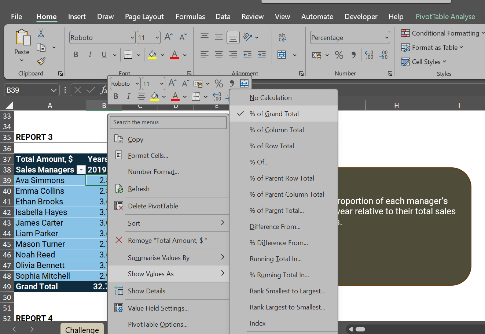
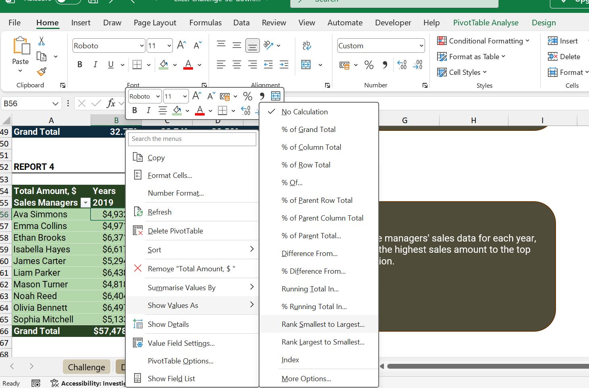
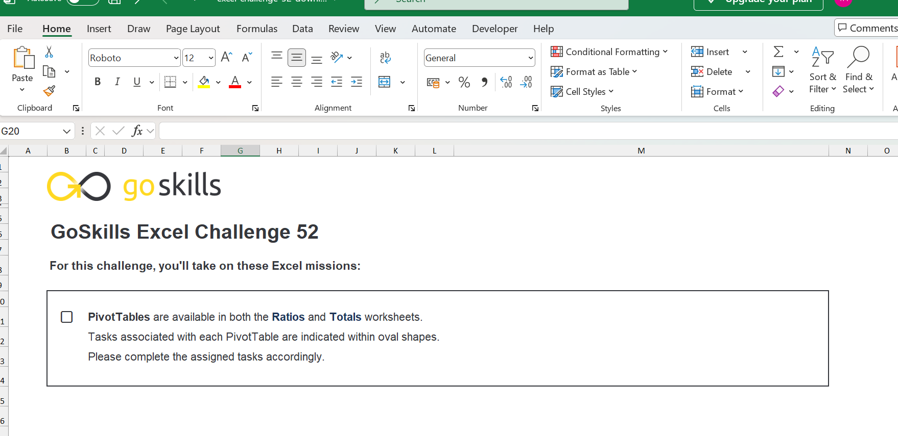
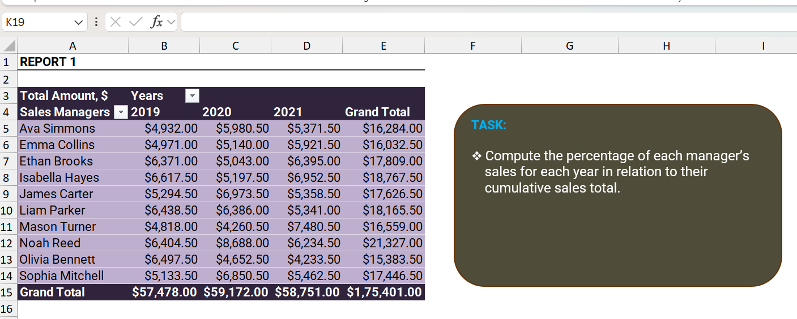
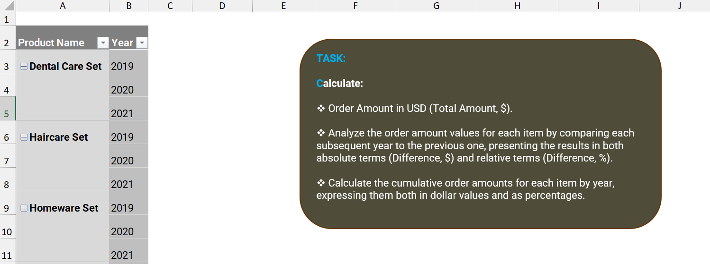

# 📊 GoSkills Excel Challenge 52 - Data Analysis with PivotTables

# 📊 GoSkills Excel Challenge 52 - Data Analysis with PivotTables

## Overview

This project is my solution to **GoSkills Excel Challenge 52**, a business analysis scenario focused on evaluating sales manager and product performance using PivotTables. The challenge required analyzing sales data across multiple years and generating insights through rankings, ratios, and cumulative calculations. :contentReference[oaicite:1]{index=1}

## Business Scenario

As a business analyst, the goal was to create reports that help management understand:

- Sales manager performance
- Product performance trends
- Annual sales rankings
- Sales contribution percentages
- Cumulative sales growth

## Skills Demonstrated

- PivotTables
- Show Values As
- Percentage Analysis
- Ranking
- Running Totals
- Business Reporting
- Data Analysis

## Solution Approach

### Report 1
Built the initial PivotTable to summarize sales performance.

### Report 2
Copied the PivotTable and calculated each manager's share of annual sales.

### Additional Analysis
Performed ranking, comparisons, and cumulative sales analysis using PivotTable calculations.

## Challenge Overview

## Files

- challenge-52-solution.xlsx
- screenshots/

## Source

Challenge completed using the free Excel practice exercise from GoSkills:

https://www.goskills.com/excel/resources/excel-challenge-52
