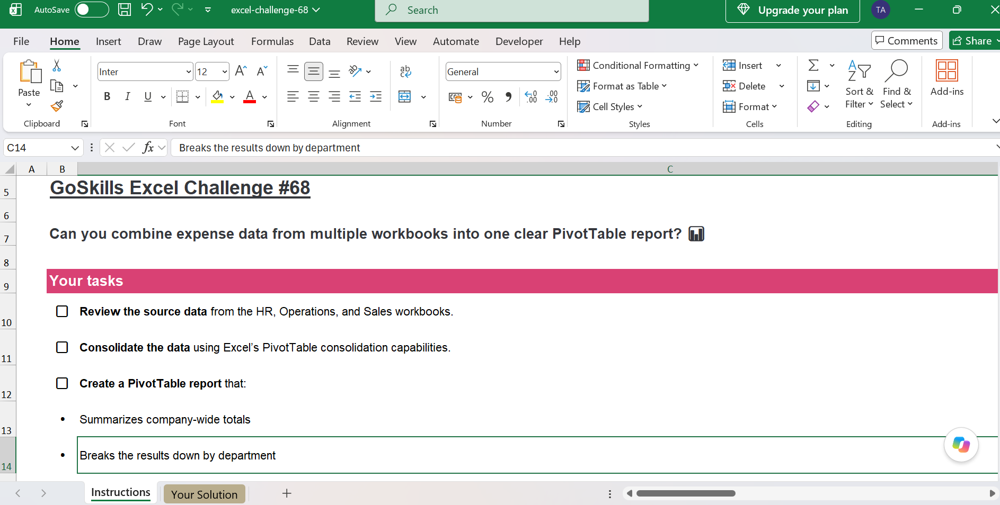
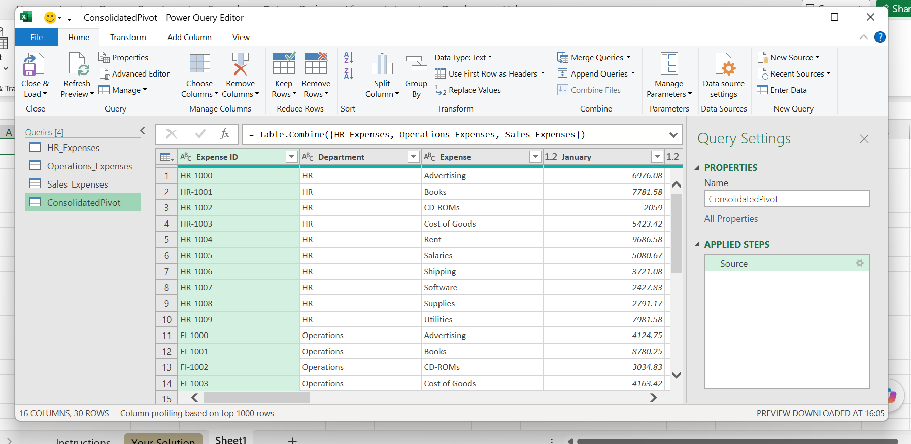
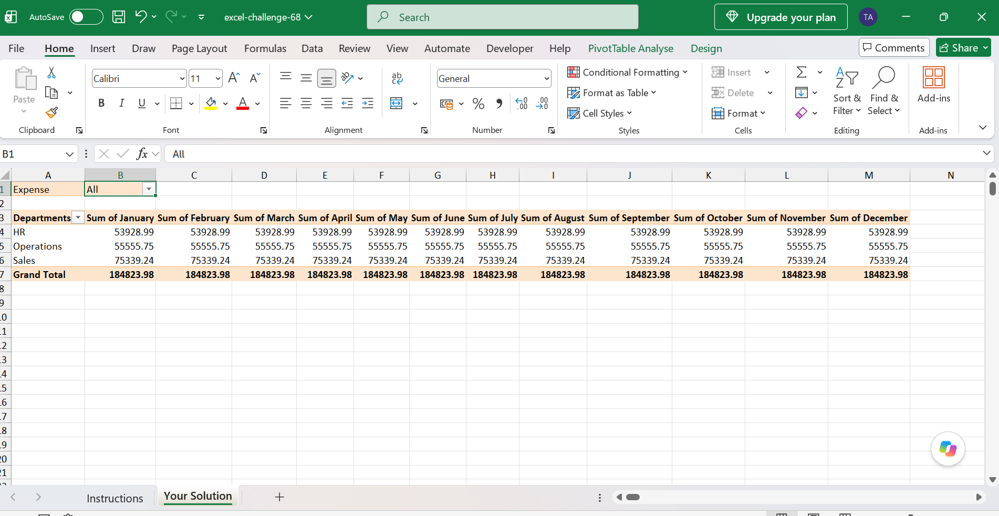

# 📊 Excel Challenge 68 — Expense Consolidation & Analysis

## 📌 Project Overview

This project solves GoSkills Excel Challenge 68, which involves
consolidating departmental expense data and creating a management
report.
## Challenge Description

## 🛠️ Approach

I used:

- Power Query
- Append Queries
- Pivot Tables
- Data Consolidation
- Data Analysis

### 🔄 Data Consolidation

Multiple departmental workbooks were combined using Power Query.

### 📈 Final Report

The resulting report provides a consolidated view of the expense data.

## 💡 Key Takeaways

- Learned how to consolidate data from multiple workbooks.
- Used Power Query Append to combine datasets.
- Created a Pivot Table from the consolidated data.
- Practiced turning raw data into a management-ready report.

## 📁 Files

- `excel-challenge-68-Solution.xlsx` — completed Excel solution
- `screenshots/` — screenshots of the solution

## 🎯 Skills Demonstrated

`Excel` `Power Query` `Pivot Tables` `Data Consolidation` `Data Analysis`
